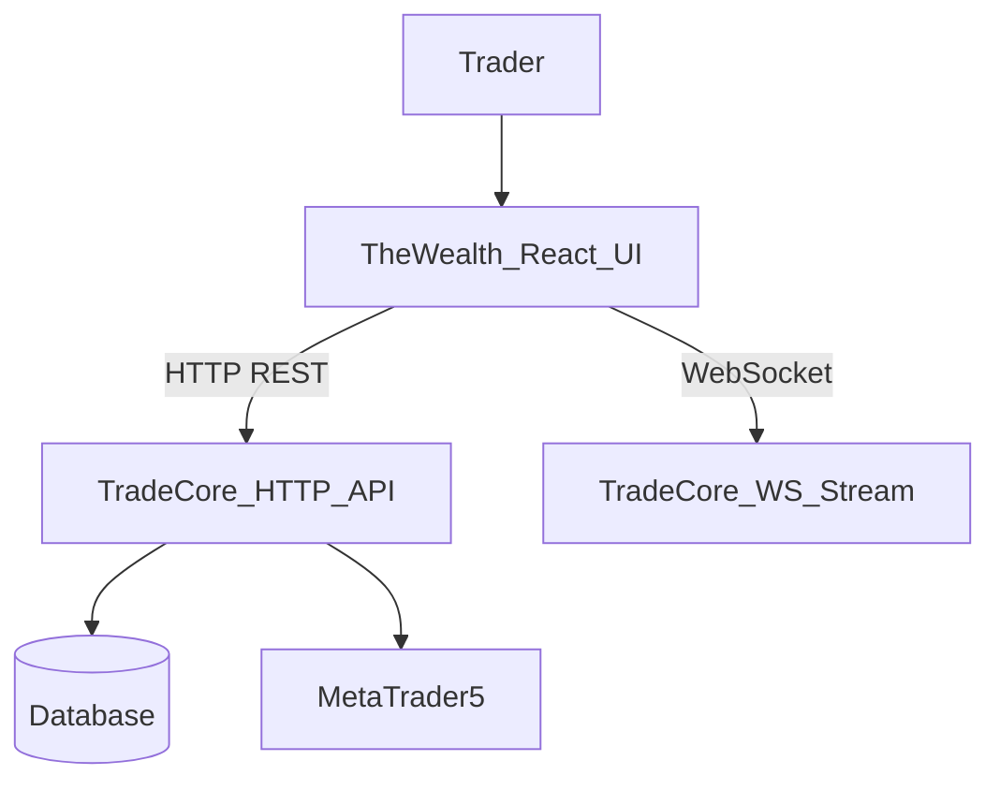

## TheWealth Architecture

### Purpose

`TheWealth` is a React Router SPA that provides a trading dashboard for `TradeCore`, including live account and price monitoring, trade entry, a journal, and additional analytics-focused views.

### High-Level Components

- **App shell and routing**
  - `app/root.tsx`: Defines the HTML shell, layout, sidebar navigation, and initializes the WebSocket connection on mount.
  - `app/routes.ts`: File-based route configuration mapping URL paths to route components under `app/routes`.
- **Feature routes**
  - `app/routes/home.tsx`: Main dashboard (account summary, open trades, live price, and quick trade execution).
  - `app/routes/trade-panel.tsx`: Focused trade entry panel.
  - `app/routes/account.tsx`: Detailed account metrics view.
  - `app/routes/journal.tsx`: Trade journal with filters and performance metrics.
  - `app/routes/risk.tsx`, `app/routes/strategies.tsx`, `app/routes/logs.tsx`, `app/routes/review.tsx`: Analytics and control pages for risk, strategies, logs, and weekly review.
- **Client services**
  - `app/services/ws.ts`: Manages the WebSocket connection to the `TradeCore` stream endpoint and broadcasts messages to subscribers.
  - A small configuration module (to be added) centralizes API and WebSocket base URLs for different environments.
- **Styling**
  - `app/app.css`: Tailwind-style utility classes and global styles for the SPA.

### Data & Control Flow



1. The user navigates the SPA and triggers data loads (e.g., account summary, journal, open trades) via HTTP requests to `TradeCore`.
2. The WebSocket client connects to `TradeCore`’s stream and updates local React state with live price, account, and positions.
3. Trade actions (open/close) call corresponding `TradeCore` endpoints, and results are reflected in the UI via both HTTP responses and subsequent stream updates.

### Running TheWealth

#### Local development

1. Install dependencies:

```bash
cd TheWealth
npm install
```

2. Configure environment (optional but recommended):

```bash
cp .env.example .env  # if present
# Configure VITE_API_BASE_URL, VITE_WS_URL to point at your TradeCore instance
```

3. Start the dev server:

```bash
npm run dev
```

By default, the app is available at `http://localhost:5173` (or the port reported by the dev server).

#### Production build

```bash
npm run build
npm run start   # or your chosen production server command
```

### Future Enhancements

- Centralize backend URLs and WebSocket endpoints in a typed config module driven by environment variables.
- Implement robust WebSocket reconnection and error handling in `app/services/ws.ts`.
- Wire risk, strategies, logs, and review routes to real backend APIs and expand test coverage for critical flows (trading, journal metrics, and account summaries).

